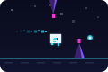

<p align="center">
  
</p>

<h1 align="center">Pixel Drift</h1>

<p align="center">
  Reusable <strong>offline runner / glider engine</strong> — Driftlet terbang lewat lorong kristal.<br/>
  Tahan untuk melayang naik, lepas untuk turun.
</p>

## Fitur

- **Mekanik drift altitude** — bukan dino-jumper: `holding` menggerakkan player naik/turun dengan akselerasi lembut.
- **Sistem level** — makin tinggi level, makin cepat & makin beragam rintangan (level 1: kristal lantai saja; level 2: + langit; level 3+: + gate).
- Karakter **Driftlet**: glider pixel cahaya + trail komet + perisai heksagon (power-up).
- Obstacle: kristal lantai (naik), kristal langit (turun), dan gate — selalu ada koridor yang lolos.
- Orb (+100 skor) & power crystal (perisai).
- Tema warna **customizable** per project.
- Skor terbaik di `localStorage` (`pixeldrift_best`), SFX WebAudio.
- Vanilla JS / Canvas — tanpa dependency runtime, framework-agnostic.

## Tema per Project

Override tampilan tanpa menyentuh engine — warna, background, accent HUD, dan
teks branding:

```js
import { PixelDrift, sobatPintarTheme, kantinTheme } from 'pixel-drift';

const game = new PixelDrift({ canvas, theme: sobatPintarTheme });
// atau custom:
const game = new PixelDrift({
  canvas,
  theme: {
    accent: '#ff9f1c',
    bg: { top: '#1a1a2e', mid: '#16213e', bottom: '#0f3460' },
    brand: { title: 'SOBAT', glow: 'PINTAR', sub: 'BELAJAR · DI MANA SAJA' },
    body: '#fff6e9', core: '#ff9f1c', obs: '#16213e', // dst lihat src/config/theme.js
  },
});
```

Preset siap pakai: `themes.default`, `themes.dark`, `themes.light`,
`themes['sobat-pintar']`, `themes.kantin`. Semua kunci warna ada di
`src/config/theme.js`; tema terang ditandai `mode: 'light'` agar halaman
luar ikut menyesuaikan (demo).

## Struktur File

```
pixel-drift/
├── package.json / package-lock.json
├── vite.config.js
├── README.md
├── src/
│   ├── index.js            # Public API: class PixelDrift
│   ├── config/
│   │   ├── layout.js       # konstanta ukuran & tuning spawn/level
│   │   ├── theme.js        # def. warna dasar per tema
│   │   └── themes.js       # presets tema (dark/light/sobat-pintar/kantin)
│   ├── engine/
│   │   ├── GameLoop.js     # loop requestAnimationFrame + delta time
│   │   ├── InputHandler.js # keyboard/touch/pointer → perintah game
│   │   ├── Physics.js      # deteksi tabrakan kotak-kotak
│   │   └── Sound.js        # SFX WebAudio
│   ├── entities/
│   │   ├── Player.js       # Driftlet (naik/turun, animasi)
│   │   ├── Obstacle.js     # kristal floor/ceil/gate (per level)
│   │   └── PowerUp.js      # orb (+100 poin)
│   └── render/
│       └── Renderer.js     # gambar semua ke canvas (bg, trail, rintangan)
├── demo/
│   └── index.html          # demo UI: theme-bar, HUD, overlay start/pause/game-over
├── offline-kit/
│   ├── sw.js               # Service Worker offline
│   ├── offline.html        # halaman fallback offline (game)
│   └── register.js         # register SW + deteksi online/offline
├── offline-site/           # HASIL generate serve-offline (jangan edit manual)
├── tools/
│   └── serve-offline.mjs   # server uji offline (mirror layout deploy)
├── mockup/
│   └── final-demo.html     # arsip demo single-file lama (referensi)
├── dist/                   # hasil `npm run build` (pixel-drift.mjs / .js)
└── node_modules/
```

### Penjelasan per file

- **`vite.config.js`** — mode *lib build* (entry `src/index.js`, output
  `dist/pixel-drift.mjs` ES + `.js` UMD) dan `server.open: '/demo/'` (Vite
  otomatis membuka demo).
- **`src/index.js`** — class `PixelDrift`: orkestrasi semua sistem (level dari
  jarak `_prog`, skor/orb, `start/pause/menu/gameover`, `getState()`, callback
  `onStateChange`/`onTick`/`onLevelUp`). Ini yang dipakai project lain.
- **`src/config/layout.js`** — `LW/LH` (resolusi 900×506), `GROUND`,
  `PLAYER_X`, `S` (skala), kecepatan/spawnGap/gateGap per level, pool rintangan.
- **`src/config/themes.js`** — factory `createTheme()` + preset `dark`,
  `light`, `sobat-pintar`, `kantin` + registry `themes{}`.
- **`src/engine/*`** — sistem terpisah: loop animasi, input, collision, suara.
- **`src/entities/*`** — Driftlet, rintangan kristal (jenis tergantung level),
  orb pengumpul poin.
- **`src/render/Renderer.js`** — background gradient, vignette, speedline,
  ground, karakter, rintangan, orb; pakai tema.
- **`demo/index.html`** — `mountGame(theme)` + theme-bar (DARK/LIGHT), HUD
  (skor, LVL, ORB, tombol pause), overlay start/pause/game-over.
- **`offline-kit/sw.js`** — `VERSION` (bump saat rilis baru), cache core
  (`/`, `offline.html`, `dist/pixel-drift.mjs`), network-first → fallback
  `offline.html` saat offline.
- **`offline-site/`** — hasil copy otomatis dari `serve-offline.mjs`
  (`offline-kit/*` + `dist/pixel-drift.mjs`). **Jangan diedit langsung**;
  edit di `offline-kit/` + `dist/`.
- **`tools/serve-offline.mjs`** — server ringan (port 8090) untuk menguji mode
  offline (SW tidak bisa diuji lewat Vite dev server).
- **`mockup/final-demo.html`** — arsip demo single-file sebelum dipecah modular.

## Penggunaan

```js
import { PixelDrift } from 'pixel-drift';

const game = new PixelDrift({
  canvas: document.getElementById('game'),
  theme: { body: '#f4d35e', core: '#ee6c4d' }, // opsional, override warna
  callbacks: {
    onTick: (state) => { /* update HUD skor */ },
    onStateChange: (mode, state) => { /* 'start' | 'playing' | 'paused' | 'gameover' */ },
  },
});

game.start();      // mulai
game.togglePause();
game.toMenu();
game.getBest();
game.destroy();    // cleanup listeners + loop
```

Kanvas/container: `canvas` akan otomatis menyesuaikan ukuran element induknya; area bermain
di-letterbox di tengah (logical resolution 900×506, 16:9). Tema default di `src/config/theme.js`.

## Development

```bash
npm install        # pertama kali saja
npm run dev        # develop di browser → http://localhost:5173/demo/
npm run build      # build library ke dist/ (ES + UMD)
npm run preview    # pratinjau hasil build
npm run serve:offline  # uji offline kit (mirror layout deploy) di :8090
```

### Cara menguji mode offline

1. `npm run build` — server uji butuh `dist/pixel-drift.mjs`.
2. `npm run serve:offline` — buka `http://localhost:8090/offline.html`
   (browser dibuka otomatis).
3. Kunjungan pertama dalam keadaan **online** agar Service Worker meng-cache.
4. Matikan jaringan (DevTools → Network → *Offline*) lalu refresh — game
   tetap bisa dimuat dari cache.

## Offline Kit

Folder `offline-kit/` berisi fallback halaman offline lengkap:

- **`sw.js`** — Service Worker: precache `offline.html` + bundle, dan otomatis
  menampilkan `offline.html` saat ada navigasi yang gagal (offline).
- **`offline.html`** — Halaman fallback mandiri yang menjalankan game
  (mengimpor `./dist/pixel-drift.mjs`), dengan indikator status koneksi.
- **`register.js`** — helper registrasi SW + pantau status online/offline.

Cara deploy (layout situs yang diharapkan):

```
<root situs>/          ← copy isi offline-kit/ ke sini
├── sw.js
├── offline.html
├── register.js
└── dist/pixel-drift.mjs   ← hasil npm run build
```

Daftarkan SW dari halaman situs (atau langsung di `offline.html`):

```js
import { registerOfflineKit, watchOnline } from './register.js';
registerOfflineKit();          // coba daftarkan SW
watchOnline((online) => { /* tampilkan status */ });
```

Bump `VERSION` di `sw.js` (misal `pixel-drift-v2`) saat rilis baru agar cache ter-update.

## Roadmap

- [x] Fase 0 — Mockup interaktif (`mockup/final-demo.html`)
- [x] Fase 1 — Struktur repo & library modular
- [x] Fase 2 — Sistem level & progresi kesulitan
- [ ] Fase 3 — Publish npm (package `pixel-drift`)
- [x] Fase 4 — Offline kit: Service Worker + `offline.html`
- [x] Fase 5 — Config tema per project & dokumentasi

## Lisensi

MIT
